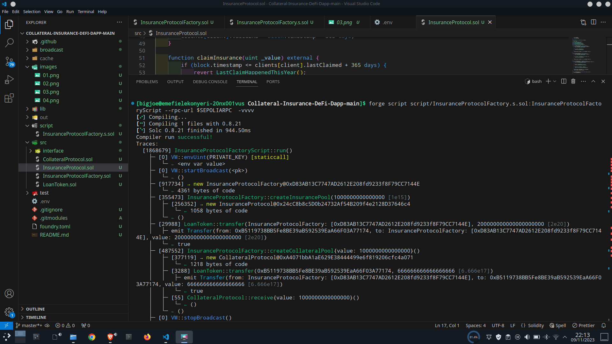
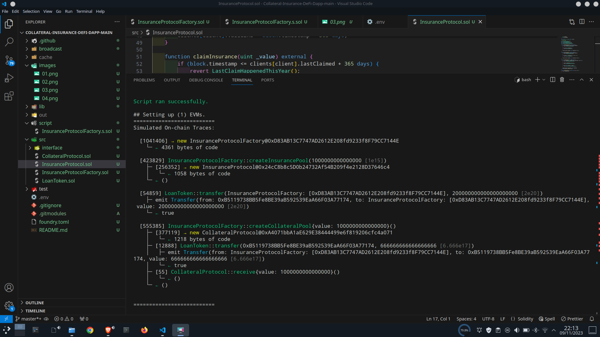
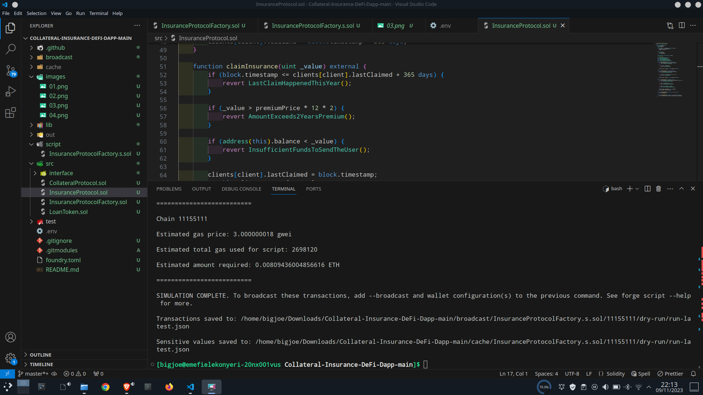

# Collateral and Insurance Protocol Contract

This is Solidity-based smart contracts in this project. The contracts enable users to purchase insurance and collateral for crypto-backed loans.

## Table of Contents

- [Collateral and Insurance Protocol Contract](#collateral-and-insurance-protocol-contract)
  - [Table of Contents](#table-of-contents)
  - [Overview-Description](#overview-description)
  - [Deploying and Verifying the Contracts on Sepolia testnet](#deploying-and-verifying-the-contracts-on-sepolia-testnet)
  - [Verified Contract Addresses](#verified-contract-addresses)
  - [Authors](#authors)
  - [License](#license)

## Overview-Description

The project includes a `factory contract model`, which allows users to create either `insurance contracts` or `collateral protection contracts`.
The factory contract can deploy instances of either a child contract based on user preference.

The insurance contract allows users to pay their premiums either `monthly` or `annually`.
The `collateral management contract`, on the other hand, monitors the value of the user's collateral.
If the collateral value drops below 20, the contract liquidates the collateral. Users can also repay their loans to retrieve their collateral.

## Deploying and Verifying the Contracts on Sepolia testnet

- 

- 

- 

## Verified Contract Addresses

- Insurance Contract:
  https://sepolia.etherscan.io/address/0x24cC8b8c5D0b24732Af54B209f4e2128D37646c4

- Collateral Contract:
  https://sepolia.etherscan.io/address/0xA4071bbA1aE629E38444499e6f819206cfc4a071

- Factory Contract:
  https://sepolia.etherscan.io/address/0xD83AB13C7747AD2612E208fd9233f8F79CC7144E

## Authors

Konies jay
[@metacraftersio](https://twitter.com/awinrin21)

## License

This project is licensed under the MIT License - see the LICENSE.md file for details.
